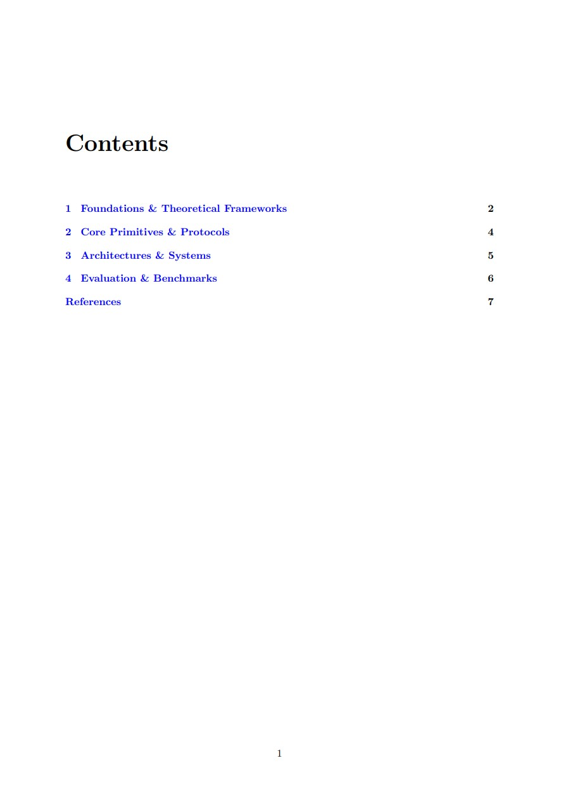
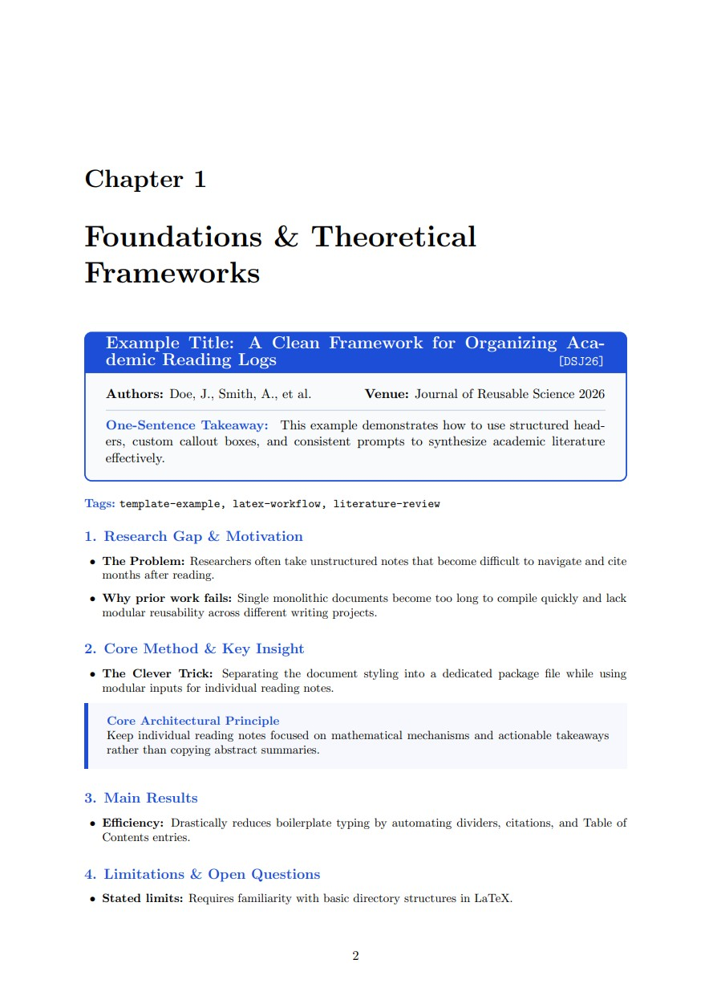

# Research Paper Reading Log Template

A clean, modular LaTeX template for organizing academic paper summaries, literature reviews, and research logs.

Instead of dumping raw notes into a single monolithic document, this template uses a **modular chapter/topic structure** with custom LaTeX environments that eliminate boilerplate typing, automate citations, and keep your Table of Contents cleanly organized.

---

## Features

- **Zero-boilerplate paper headers.** The `paperbox` environment formats metadata, generates dividers, and registers paper titles directly into your Table of Contents.
- **Modular structure.** Group papers by research theme (`topics/01_foundations/`, etc.) using `\input{}` to keep compilation fast and navigation seamless.
- **Custom callout boxes.** Use `\begin{insightbox}` to highlight core equations, clever algorithmic tricks, or key architecture diagrams.
- **Section shortcuts.** Use `\loggap`, `\logmethod`, `\logresults`, `\loglimitations`, and `\logtakeaways` to format consistent section headings without retyping formatting code.
- **Cross-topic tagging.** Use `\logtags{tag-one, tag-two}` to label papers by theme, so you can search across topic folders regardless of which chapter a paper is filed under.
- **BibTeX and hyperref integrated.** Get alphanumeric citation labels (`[DSJ26]`) with clickable, colored links.

---

## Preview

<p align="center">
  
  
</p>

*Left: the auto-generated Table of Contents. Right: a fully-rendered example entry showing the `paperbox` header, section prompts, and `insightbox` callout.*

[View the full compiled example](example/example-output.pdf)

---

## Quickstart Guide

### Option 1: Use with Overleaf
1. Download this repository as a `.zip` file (or click **Use this template** to create your own repo).
2. Go to [Overleaf](https://www.overleaf.com/) and select **New Project** → **Upload Project**.
3. Upload the `.zip` file and recompile `main.tex`.

### Option 2: Use Locally (VS Code, TeXStudio, Neovim)
1. Click the green **Use this template** button at the top right of this repository to generate your own repo.
2. Clone your new repository:
   ```bash
   git clone https://github.com/BoonHow97/research-reading-log-template
   ```
3. Compile `main.tex` using `latexmk` or your preferred LaTeX build engine. Make sure BibTeX/Biber is enabled.

---

## Repository Structure

```text
research-reading-log-template/
├── LICENSE                       # MIT License
├── README.md
├── figures/                      # Store architecture diagrams and plots here
├── topics/                       # Modular paper folders grouped by research theme
    ├── 01_foundations/
    │   └── example_paper.tex     # Example paper note
    ├── 02_primitives/
    │   └── example_paper.tex
    ├── 03_architectures/
    │   └── example_paper.tex
    └── 04_evaluation/
        └── example_paper.tex
├── main.tex                      # Master dashboard, TOC, and \input{} calls
├── paperlog.sty                  # Core styling, tcolorbox setups, and shortcut macros
├── references.bib                # Master BibTeX bibliography file
└── search_tags.py                # Search papers by \logtags{} across topic folders
```

---

## Anatomy of a Paper Note

Use this standard structure when adding a new paper note to a topic folder:

```latex
% Usage: \begin{paperbox}{Title}{Authors}{Venue & Year}{BibTeX Key}
\begin{paperbox}
    {Paper Title Goes Here}
    {Author, A., Author, B., et al.}
    {Conference / Journal 2026}
    {citationKey2026}
    Write a dense, one-sentence takeaway summarizing the paper's primary contribution.
\end{paperbox}

% Usage: \logtags{tag-one, tag-two, tag-three}
\logtags{tag-one, tag-two, tag-three}

\loggap
\begin{itemize}
    \item \textbf{The Problem:} State the gap or failure in prior work that motivated this paper.
    \item \textbf{Why prior work fails:} Explain specifically why existing baselines fall short.
\end{itemize}

\logmethod
\begin{itemize}
    \item \textbf{The Clever Trick:} Describe the core algorithmic shift, architectural change, or mathematical formulation.
\end{itemize}

\begin{insightbox}[Core Mechanism / Key Insight]
    Highlight a standout equation, loss function, or architecture diagram here.
\end{insightbox}

\logresults
\begin{itemize}
    \item \textbf{Key Findings:} Summarize standout empirical benchmarks, theoretical guarantees, or latency/accuracy improvements.
\end{itemize}

\loglimitations
\begin{itemize}
    \item \textbf{Stated limits:} Note explicit limitations acknowledged by the authors.
    \item \textbf{My critique:} Flag unrealistic assumptions, edge cases, or computational overhead.
\end{itemize}

\logtakeaways
\begin{itemize}
    \item \textbf{Relevance:} Connect this paper to your current research or literature review.
    \item \textbf{Action Items:} List specific baselines to compare against or experiments to try.
\end{itemize}
```

---

## Tagging & Search

Since each paper lives in a single topic folder, `\logtags{}` lets you label a paper with themes that cut across folders (e.g., a cryptography paper that's also relevant to a specific course project). Add it directly after the `paperbox` call:

```latex
\logtags{uncloneable-crypto, QROM, cs2309}
```

Once you've tagged a few papers, search across every topic folder using the included `search_tags.py` script:

```bash
python3 search_tags.py                                         # list every tag in use, with counts
python3 search_tags.py literature-review                       # find papers tagged "literature-review"
python3 search_tags.py literature-review latex-workflow        # find papers tagged with ALL of these
python3 search_tags.py --any literature-review latex-workflow  # find papers tagged with ANY of these
```

Each result shows the file path, paper title, and full tag list. Run it from the repository root (the folder containing `topics/`).

If you'd rather not use Python, a plain `grep` also works as a no-dependency fallback:

```bash
grep -rn "logtags{.*literature-review" topics/
```

This returns every file and line where "literature-review" appears in a tags block, regardless of which chapter it's filed under. Note that `grep` does substring matching, so a tag like `literature-review-2` would also match this query — `search_tags.py` does exact tag matching and won't have that issue.

---

## Adding a New Paper to Your Log

1. Create a new `.tex` file inside the relevant topic folder (e.g., `topics/02_primitives/smith_2026.tex`).
2. Paste the paper note structure above, fill in your notes, and set `\logtags{}` to relevant themes.
3. Add the BibTeX citation to `references.bib`.
4. Open `main.tex` and include your new file under the corresponding chapter:
   ```latex
   \chapter{Core Primitives \& Protocols}
   \input{topics/02_primitives/smith_2026}
   ```
5. Recompile your document.

---

## License

This template is open-source and available under the [MIT License](LICENSE). Feel free to fork, customize, and share it.